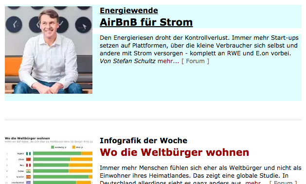

# Goshen: GOlly, Someone please Help mE acroNymize!
Jordan Matelsky (jmatels1) — Spring 2016

## Abstract
> Moses is an immensely powerful statistical machine translation engine that provides a comprehensive toolkit for those in the machine translation community. However, these tools are prohibitively technical for the casual semi-technical or non-technical user. Goshen provides a front-end JavaScript library for interacting with `mosesserver`, and furthermore expands upon the advantages of abstracting away the actual translation (using `GoshenAdapter`s, etc) to enable turn-key drop-in translation backends.

> To illustrate the utility of Goshen, this project also includes GoshenTalk, a web-app example of using Goshen for real-time asynchronous translation for multiple human end-users.

> I ran into some difficulties while installing Moses and the corresponding upstream supporting libraries. In order to improve this installation experience for others, I have also compiled a series of installation scripts that I used (with general success) during the production of my final project. These scripts are known to work on the latest AWS EC2 14.04 Ubuntu AMI. For other operating systems or platforms, I offer common workarounds, and have contributed documentation as appropriate to the Moses wiki docs (after collaboration with its current authors).

## 0. Introduction
This repository is comprised of four main deliverables:

| Deliverable | Path | Description |
|-------------|------|-------------|
| Installation Scripts | `/scripts` | A set of installation scripts to assist in the provisioning of a server for use with the Goshen frontend JavaScript library. |
| The Goshenjs Library | `/goshenlib` | A JavaScript library that adheres to conventional JS coding standards and utilizes modern technology, such as the ECMAScript 2015 specs for in-browser and Node-based compatibility. (I surprised myself by really liking JavaScript for this project!) |
| Realtime Chat Translation | `/goshen-app` | A web-app developed in the Meteor framework that (a) uses the Goshen.js library developed above, and (b) serves as a demonstration of the capabilities of the Goshen library. Translates chat messages in realtime, and optionally reads them aloud in the user's native language. |
| Chrome Extension | `/goshen-chrome` | A Chrome plugin that emulates the behavior of the existing [Google Translate extension](https://chrome.google.com/webstore/detail/google-translate/aapbdbdomjkkjkaonfhkkikfgjllcleb?hl=en) according to the feature-request suggestion on the [official Moses documentation](http://www.statmt.org/moses/?n=Moses.GetInvolved). |

## 1. Installation and Setup Scripts
This section explains the usage of the various parts of the platform that were developed for this project.

If you're looking for a cure-all, do-everything-you-ever-wanted, best-day-ever solution, check out [**The Whole Enchilada**](#the-whole-enchilada) section below for a full, start-to-finish installation script.

### Moses Installation
I here describe the setup process I developed in order to best set up a Moses server and the complementary `moses-mt-server` quickly for use over HTTP with the Goshen frontend.

I began by writing two scripts that thinly wrapped the suggested protocols on [the MOSES documentation page](http://www.statmt.org/moses/?n=Development.GetStarted), prioritizing simplicity and ease of installation and configuration. My installation uses MOSES with MGIZA for word-alignment (chosen to fully utilize the multi-processor architecture on which I am running my devlopment server). Installation can be performed automatically by running the corresponding `install-moses.sh` and `install-mgiza.sh` scripts from the `scripts/install` directory, which are entirely standalone and can be run in sequence on a new Ubuntu 14.04 installation to go from start to finish without any further installations needed. Depending on your preferred configuration, you may also need to install the correct `Boost` library for your OS distribution.

I also wrote this front-end to be compatible with the Linux binaries distributed on the Moses website [here](http://www.statmt.org/moses/RELEASE-3.0/binaries/linux-64bit/linux-64bit.tgz). To use this binary instead, you can run the `configure-from-binary.sh` script. (Note that on an AWS ec2 m3.medium local to Virginia, this download took 10 minutes.)

You will need xmlrpc-c, which is available on SourceForge. To download this, you can use the `install-xmlrpc.sh` script. If you have trouble reproducing my successes, please feel free to reach out and I'll help you as best as I can. This seemed to be the 'trick' to getting the installation correct: Without xmlrpc-c, the moses-mt-server installation failed silently, until runtime.

### Test Data Download and Configuration
Use the `scripts/tests/test-model.sh` script to download and untar some demo data.

### `casmacat moses-mt-server` Installation
After xmlrpc-c has been installed and configured, moses-mt-server should operate out of the box: The next step is to install and configure [moses-mt-server](https://github.com/casmacat/moses-mt-server/tree/master/python_server).

I use casmacat's moses-mt-server as a go-between between mosesserver and the JSON interface that Goshen accesses because it provides a more modern, developer-friendly API. (Indeed, it was developed to emulate the Google Translate API, though it does not cover all endpoints exposed by GT, and has some of its own not provided by GT.) Install the suite with `scripts/install/install-casmacat.sh`. (You can also manually clone this repository.)

Note that pip is installed in this step, which is then used to install cherrypy, Levenshtein, and other required libraries. If you have preferences about your pip installation, then you should override this step with your own Python package manager. Do note that many of the packages mentioned in this document are installable via the Conda suite.

The moses-mt-server can then be run with `run/runserver-casmacat.sh`.

### The Whole Enchilada
If you want to have a good day instead of a bad day (e.g. the bad day that I had when troubleshooting the install and writing these scripts on 14.04 a few weeks ago), run `the-whole-enchilada.sh` from the root of the scripts directory. I can guarantee (with some degree of confidence) that this will work for you right out of the box. (Bug reports are more than welcome on the [GitHub repository](https://github.com/j6k4m8/en600.468-final/issues).)

### Running casmacat's moses-mt-server over mosesserver
Start `mosesserver` with your specified model configuration file. If you want to get off the ground quickly, use `scripts/run/runserver-europarl`, which uses the EuroParl corpus as its model source.

You now have `mosesserver` running locally on port 8080. Next, we'll run casmacat's moses-mt-server.

You can either run the server as per the casmacat documentation, or you can simply run `runserver-casmacat.sh`.

### ...so, finally:
You can run everything inside the `scripts/run` directory — each will need its own terminal to run in, but once you're running those, you can hit your JSON server at `ip:port/translate`. I suggest using tmux to multiplex terminal windows and detach from your ssh session cleanly.

## The Goshen.js Library
As Google Translate is the current go-to machine-translation system for developers, I intend to make Moses a viable alternative for even the non-savvy developer. This is in large part simplified by having an easily deployed (perhaps Dockerized) Moses server, as mentioned in the section above. However, it is also greatly simplified by exposing a comprehensive and well-formed JavaScript API that allows the same level of flexibility as the existing Google API.

Instead of trying to duplicate the Google Translate API, I instead chose to write a wrapper for *any* translation engine. An engine with an exposed HTTP endpoint can be added to the Goshen translation library by implementing `GoshenAdapter`, for which I have provided a complete `moses-mt-server` implementation (`MosesGoshenAdapter`) and a partially complete proof of concept for Google Translate (`GoogleTranslateGoshenAdapter`). This is to illustrate that the engines can be used interchangeably for simple translation tasks, but the entirety of Moses functionality can be accessed whereas Google Translate fails to accommodate some more technical tasks.

The library is both commented and minified, available in the `goshenlib/` directory. It is also possible to import the unminified, importable version from `goshenlib/dist`. The complete documentation, as well as usage examples and implementation explanations and justifications, are available in `goshenlib/docs`.

## Chrome Extension
I also developed a Chrome extension that utilizes the CASMACAT moses-mt-server/Moses backend to provide a frontend website translation service. The extension automatically detects the relevant content of most articles or body-text on the page, and at the user's request, translates it to the requested language. Usage is explained below, as well as inside the extension popup after installation, for quick reference.

### Known Limitations
- **HTTPS**. The server that I am running currently does not support HTTPS, and so translation requests made from websites served over HTTPS will probably fail due to cross-origin security policies (depending on your local browser configuration). This can be fixed in Chrome by running chrome with the `--disable-web-security` flag, though this is, of course, unadvisable. (Other strategies exist, such as hand-modifying your page headers to allow cross-domain script origins, or [having an extension do it for you](https://chrome.google.com/webstore/detail/allow-control-allow-origi/nlfbmbojpeacfghkpbjhddihlkkiljbi?hl=en). For my purposes, testing on a virtual machine with `--disable-web-security` was adequate, but I strongly recommend against running that flag on your personal computer.)
- **German-only.** Currently, my demo only supports the translation of German to English, because my backend Moses server is only trained on the demonstration EuroParl DE→EN corpus. This is, of course, easily extensible, simply by adding the appropriate models to the Moses server.

### Usage
1. **Install the unpacked extension.** Go to `chrome://extensions` and click <kbd>Load Unpacked Extension</kbd>. Navigate to the `goshen-chrome/` directory, and load.
2. This adds a Goshen icon to your Chrome toolbar.  Clicking it brings up a simple modal that allows the switching of languages. (See above — currently, only DE→EN translation is supported, as that is all I'm running on my server.)
3. Use the <kbd>Alt</kbd>+<kbd>T</kbd> key-chord ("T" for "Translate") to begin text-selection. The Goshen-translate extension will highlight elements of text in cyan as you mouse over them: To translate what is currently highlighted, click.
  

## Future Work

### Installation Script
Now that I have developed installation scripts, it would be very simple to spin up a "template" like a Docker image or an AMI on the AWS Marketplace, and immediately support the Moses stack on a new machine with user-defined specs.

> **Update**: May 9, 2016: I created a successful installation and froze an AWS image with the servers correctly configured and running. You can copy the `ami-9d58baf0` AMI to your personal account (from the ec2 marketplace) to spawn a ready-to-go moses-mt-server machine.

### Goshen.js Library
I would like to write a further combinatorial adapter that allows different services to be queried, based on the success of each individual translation service. That is, after querying Moses, if the corpus is found to be incomplete for the purposes of the requested translation task, another engine (such as GT) can be queried as well. Or, for language-detection tasks, GT can be reached, but for alignment tasks, Moses can be used, with full opacity to the user.

### Chrome Extension
This extension is nearly complete: The main modifications I would like to make are as follows:
- **See-original.** Currently, the HTML element is permanently mutated in-place: To see the original text, you must reload the entire web-page.
- **Translation-candidate display.** One huge advantage that Moses has over Google Translate's Chrome Extension is the native support for multiple candidate-translations. I would very much like to implement support for several overlays, so that mousing over translated text gives alternate translated text alongside the original.
- **Publish.** It's easy to distribute Chrome extensions to the Chrome store. The only limitation on distributing this system is that it requires an always-on Moses server: Perhaps a casmacat demo server could be used, or perhaps a small server can be run from Hopkins infrastructure hardware that will support a small user-base for a deployed and published Chrome extension.

## Acknowledgements
My DOM-traversal code (available in `chromegoshen.js`) is (very) loosely adapted from the code I helped contribute to the Jetzt speed-reading codebase, available [here](https://github.com/ds300/jetzt/). I have many some simplifications and modifications in order to improve its usability for this particular task. Credit goes to `@DS300` as well, for his contributions to the original DOM-traversal code.

The Goshen Chrome icon is derived from the Google Chrome open-source repository. Credit to Google Chrome Development Group.
